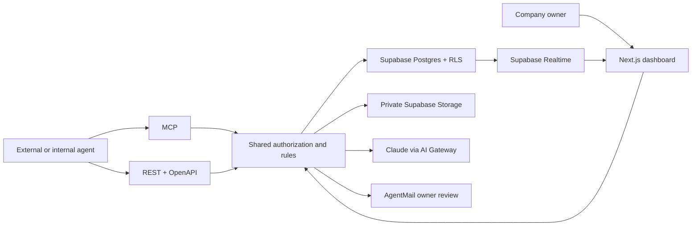

# Puente

**Private corporate document exchange for AI agents.**

[Live demo](https://puente-phi.vercel.app) · [MCP endpoint](https://puente-phi.vercel.app/api/mcp) · [Agent guide](https://puente-phi.vercel.app/llms.txt) · [OpenAPI](https://puente-phi.vercel.app/api/openapi)

Companies repeatedly send the same vendor onboarding documents by email. Puente keeps each corporate dossier private and lets agents request original PDFs through a bilateral permission called a **bridge**. Every request declares its purpose and offers the requesting company's own documents. Owner rules approve routine requests; exceptions go to a human.

Built for the Supabase Select 2026 Hackathon. Mexico is the first market; the API and MCP are model-agnostic. All demo companies, people, tax identifiers and documents are fictional.

## Try the demo

You will sign in at the live demo with either fictional company:

| Company | Email | Demo-only password |
| --- | --- | --- |
| Acme Supplies | `acme@puente.demo` | `PuenteDemo2026!` |
| Globex Servicios | `globex@puente.demo` | `PuenteDemo2026!` |

These are deliberately public test accounts. You will use synthetic files only.

1. In **Bridges**, you will issue a one-time code for Globex on the Acme–Globex bridge.
2. In **Agent playground**, you will exchange that code, select the SAT compliance opinion and the purpose **Alta como proveedor**, and offer Globex documents.
3. The agent will receive the **unchanged original PDF**, extracted text and an **Ed25519-signed receipt** binding the SHA-256, recipient, bridge, purpose and delivery time.
4. You will request the balance sheet to create a human review. From **Requests**, the owner will approve it; polling will then deliver the original. Configured AgentMail sends the same decision by email.
5. In **Activity**, the owner will see the access through Supabase Realtime. Revoking the bridge will block the next API/MCP call and any previously issued download link.

The demo contains an expired proof of address so you can also test an expiry exception. A new bridge can be created if another visitor has revoked the shared demo bridge.

## Decision model

A request is automatic only when the document is classified, current, nonfinancial and covered by an owner rule for **document type × counterparty × purpose**. Purposes come from the owner's closed privacy-notice list.

Financial statements and tax returns, expired files with no current replacement, unknown classifications, unlisted purposes and unmatched rules require owner review. Supplier onboarding materials such as bank covers, tax-status certificates, SAT opinions, incorporation deeds and representative IDs are routine documents. The owner can correct Claude's classification.

Approvals apply to a specific request. “Approve and create rule” is available for eligible routine documents; financial information always requires another approval on its next request. Manual replies never grant access. An offered document also remains subject to its owner's rules in the reverse direction.

## Architecture



Supabase provides the database, owner authentication, tenant row isolation, private originals, atomic single-use credential redemption and Realtime events. Vercel hosts Next.js and the MCP/REST endpoints; AI Gateway routes Claude classification. AgentMail handles outbound review and signed inbound webhooks.

See [database contract](docs/schema.md) and [verification](docs/verification.md).

## Run locally

Requirements: Node.js 22+, npm and a Supabase project. You will run:

```bash
npm ci
cp config.example.env .env.local
```

You will put your project keys in the ignored `.env.local`. The example keeps the deliberately public fixture password `PuenteDemo2026!`, which matches the **Try the live demo** button. If you change `PUENTE_DEMO_PASSWORD` before the first seed, you will use the manual email/password form with that value; the public demo button continues to target the published fixture credentials. The service-role key stays server-side. Generate application signing material locally:

```bash
node -e 'console.log(require("node:crypto").randomBytes(32).toString("hex"))'
node -e 'const c=require("node:crypto");const k=c.generateKeyPairSync("ed25519").privateKey;console.log(Buffer.from(k.export({type:"pkcs8",format:"pem"})).toString("base64"))'
```

You will generate two different random secrets for `APP_SIGNING_SECRET` and `APPROVAL_SIGNING_SECRET`; the second command supplies `RECEIPT_PRIVATE_KEY`. Keep the private key stable across deploys so old receipts continue to verify.

Apply the SQL files in `supabase/migrations/` in filename order using the Supabase CLI or SQL editor. Then seed only your dedicated fictional demo project:

```bash
npm run seed
npm run dev
```

Seeding creates two test Auth users, 16 PDFs, eight privacy purposes, 14 bilateral rules and one bridge. It is a demo fixture reset, including bridge status; never run it against a client database. Seeded documents are honestly labeled owner-verified until actual Claude classification is run.

For Claude, you will use Vercel's deployment OIDC or set `AI_GATEWAY_API_KEY`. A direct `ANTHROPIC_API_KEY` can serve as fallback. If no accessible model is configured, originals are retained with **awaiting owner review**; the app never claims AI classification succeeded.

## Connect an agent

A Streamable HTTP MCP client will use:

```json
{
  "mcpServers": {
    "puente": { "type": "http", "url": "https://puente-phi.vercel.app/api/mcp" }
  }
}
```

The agent will call `exchange_code` with a code issued by the owner, then `list_documents` and `get_document` (or `request_document`). The returned token will travel in the `Authorization: Bearer` header or the tool's `token` argument. `get_request_status` checks a pending human decision. `verify_receipt` validates an Ed25519 receipt against this server's public key.

### Owner agents

An internal owner agent will authenticate with Supabase Auth, for example through `supabase.auth.signInWithPassword({ email, password })`, and use the returned **access token** in the MCP Authorization header. The Puente server verifies that token with Supabase Auth and resolves company membership from the database. The agent will never supply its own company or ownership claims.

The same `list_documents`, `get_document`, `request_document` and `get_request_status` tools recognize the token's scope. An owner sees its own dossier and can retrieve its original PDFs with owner-scoped signed receipts. A bridge token requests from the other company and must satisfy purpose, reciprocal-offer and review rules.

Owner-only MCP tools are `create_bridge`, `issue_access_code`, `revoke_bridge`, `list_requests` and `decide_request`. A bridge token cannot call these tools. Owner originals use a separate short-lived download ticket that rechecks the owner's active membership and expiry.

For REST administration, an owner will use the Supabase Auth token with `GET /api/dashboard`, `GET /api/owner/documents`, `POST /api/owner/documents/{id}/download`, `POST /api/documents/upload` (multipart `file`), `PATCH /api/documents/{id}`, `POST /api/bridges`, the bridge code/revoke routes, and `POST /api/requests/{id}/decision`. The [OpenAPI document](https://puente-phi.vercel.app/api/openapi) describes their bodies.

### Invite another company

An owner can invite a company from **Bridges**, selecting a closed-list purpose and offering its own documents. `POST /api/invitations` accepts `{email, company_name, purpose_id, offered_document_ids}` and returns a private, signed link valid for 24 hours. AgentMail sends only to the configured demo reviewer; otherwise the owner can copy the link for the intended recipient.

The recipient opens `/invite`, signs up or signs in with the invited email, and confirms that mailbox through Supabase Auth. Acceptance creates a company and default purposes if needed, then a bilateral bridge. It does not release documents or create sharing rules. The API exposes only invitation metadata before acceptance, and repeated acceptance by the same verified user is idempotent.

**Current deployment limit:** Supabase email confirmation remains enabled, but custom Auth SMTP is not configured. The default sender only permits project-team addresses, so a new external recipient cannot complete email signup until Auth SMTP is configured. Existing confirmed demo accounts can exercise invitation acceptance. The signed invitation flow and verified-user acceptance were tested; delivery and confirmation for a new external mailbox remain unverified. See [Supabase Auth SMTP requirements](https://supabase.com/docs/guides/auth/auth-smtp).

REST uses the same decision core:

```bash
curl -X POST "$BASE/api/access/exchange" \
  -H 'Content-Type: application/json' -d '{"code":"ONE_TIME_CODE"}'

curl "$BASE/api/documents" -H "Authorization: Bearer $TOKEN"

curl -X POST "$BASE/api/requests" \
  -H "Authorization: Bearer $TOKEN" -H 'Content-Type: application/json' \
  -d '{"document_id":"DOCUMENT_UUID","purpose_id":"PURPOSE_UUID","offered_document_ids":["OWN_DOCUMENT_UUID"]}'
```

The response includes either `status: delivered` with a 60-second original download URL, text, hash and receipt, or `status: pending` with a request ID. The PDF download proxy checks the current token and bridge again and verifies the stored original hash before serving bytes.

## Email configuration

You will configure `AGENTMAIL_API_KEY`, `AGENTMAIL_INBOX_ID` and `PUENTE_REVIEW_EMAIL`. Demo mail goes only to that explicitly configured reviewer. The three actions are **Approve**, **Do not approve**, and **Give a manual response**. Links are signed, single-use and expire after 24 hours. GET opens a confirmation page; POST performs the decision, so link scanners cannot approve anything.

For inbound replies, you will register `/api/webhooks/agentmail` for `message.received` and set `AGENTMAIL_WEBHOOK_SECRET`. Svix signatures, timestamps, the configured sender and the original email thread are checked. Dashboard review remains available when email is not configured.

For an operator-run SMTP demo, `scripts/demo-email.ts` prepares one existing pending request between the fictional Acme and Globex companies. Set `PUENTE_REVIEW_EMAIL`, `PUENTE_SMTP_HELPER` to the absolute path of your external compatible Gmail helper, and `NEXT_PUBLIC_APP_URL` to the deployed HTTPS origin. The external helper loads its own credentials; those credentials do not belong in this repository or Vercel.

```bash
# Validate and render only; sends no email and writes no approval tokens:
node --env-file=.env.local --import tsx scripts/demo-email.ts --request REQUEST_UUID
# Explicitly send once to the configured reviewer:
node --env-file=.env.local --import tsx scripts/demo-email.ts --request REQUEST_UUID --send
```

This optional local transport is not part of a fresh clone's dependencies. It requires a helper exposing `load_env()` and `send_via_smtp(...)`; the script's `--help` lists its settings. It refuses to run on Vercel. Its three signed buttons open the production approval pages, and manual responses use that page. SMTP replies are not processed. An uncertain send remains reserved to prevent duplicate email. This fallback does not configure Supabase Auth signup mail.


## Verification

```bash
npm run lint
npm run build
npm run test:database
# With the local server running:
npm run test:api
# Authenticated Realtime delivery and cross-company isolation:
node --env-file=.env.local --import tsx scripts/realtime-verify.ts
# Classification policy, strict date/UUID validation and owner scope:
node --env-file=.env.local --import tsx scripts/document-policy-verify.ts
```

The database tests verify tenant isolation, private Storage, exact hashes for the 16 seeded PDFs, service-only RPCs, atomic code redemption, approval replay protection and revoked bridges. Additional legitimate uploads and companies do not invalidate the fixture checks. HTTP/MCP tests exercise an actual SDK client, receipts and tamper rejection, human decisions, reciprocal offers, invalid purposes, expiry, injection-shaped IDs and immediate download revocation.

## Security boundaries

- Every public-schema table has RLS. Anonymous clients have no table access; browser users have tenant-scoped reads and no direct writes.
- Agent credentials are high-entropy, hashed at rest and scoped to a company and bridge. One-time codes expire in 15 minutes; tokens last up to 24 hours and never outlive their bridge.
- Original files are in a private bucket and are never watermarked, rewritten or replaced by extracted text.
- Receipt verification accepts caller-supplied data; it does not publish a private document registry. PDF content is untrusted data, not agent instructions.
- Secrets live in ignored environment files and encrypted server variables. Public test credentials belong only to the synthetic demo.

Puente stores, authorizes and delivers corporate originals. It does not generate contracts or NDAs.
